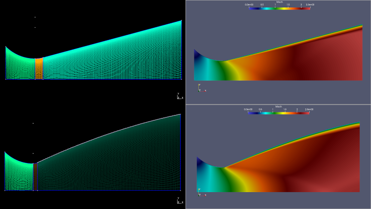
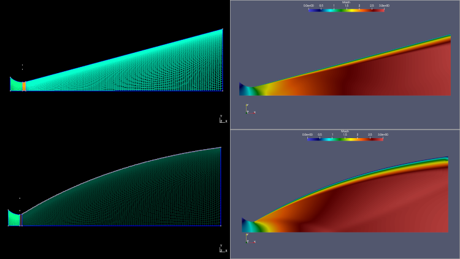

# CFD Flow Simulation for Supersonic Nozzles-Conical and its Bell equivalent (RANS-SST)
> Flow simulation of nozzles using SU2 solver using structured mesh with RANS-SST combination. As a test case PSLV stage 1 and stage 3 nozzle sizes were used.  
    
&nbsp;    
#### Update (27-DEC-22) : Config file updated for SU2 (Version-7.4.0)    

## Table of contents
* [General info](#general-info)
* [Screenshots](#screenshots)
* [Setup](#setup)
* [How to run ](#how)
* [References](#references)
* [Updates](#updates)
* [To-do list](#to-do)

## General info   
* Gmsh geometry file is written using python wrapper and generates the .su2 file required for the SU2 solver.    
* SU2 configuration is set with RANS (Governing equations - Reynolds-averaged Navier-Stokes) and SST (Turbulence model - Shear Stress Transport).   
* RANS-SST is very sensitive to mesh geometry, size, CFL number, multigrid parameters.    

>**Script features**    
>  
1.  Python script 'trans_nozzle_structured.py' designs **both** conical along with its bell equivalent nozzle and generates structured mesh in .su2 format directly.  
2. Generated files are bell_nozzle_cgrid.su2 and  conical_nozzle_cgrid.su2.
3. Included in the configuration file, the following test case scenarios.  Commented one case. 

>**Test Cases**    
>
1.  *PSLV 1st stage Nozzle*: Conical, Area Ratio : 8.0, Throat Radius : 836   
PS1-Max-thrust conditions: MEOP = 5.88 MPa, Tc = 2900 K, Pa = 74293.6 Pa [around approx. 17th sec of flight @ alt = 5.6 Km]    
2. *PSLV 3rd stage Nozzle*: Bell, Area Ratio : 51.0, Throat Radius : 100.52   
PS3-Max-thrust conditions: MEOP = 6.37 MPa, Tc = 2900 K, Pa = 0.0009964 Pa [around approx. 320th sec of flight @ altiutde 136.0 km]

## Screenshots
    

> **PSLV 1st stage Nozzle (conical). Also included Bell equivalent.  **

>Area Ratio : 8.0, Throat Radius : 836    
   
     
&nbsp;   
&nbsp;   
> **PSLV 3rd stage Nozzle (bell). Also included conical equivalent.**  

>Area Ratio : 51.0, Throat Radius : 100.52    
     

## Setup
Tested the code on Linux based setup.    
>   
1. Gmsh (Version-4.7.1) with python module - Mesh generation
2. SU2 (Version-7.4.0) - CFD solver 
3. Paraview (Version-5.7.0) - flow visualization  

&nbsp;    
SU2 appears in two flavours. Single core/cpu version or MPI version for parallel computations.    
If you have multi-core processor, then MPI version speeds up the computation. You need to install MCICH   

## How to run   
> Download the files.       
> 
> Generate mesh   
> 
* Verify and install required modules    
* run `python trans_nozzle_structured.py`.    

> Single CPU mode:   
> 
* Execute `SU2_CFD nozzle_rans_sst.cfg` on terminal.    
* Open flow.vtu file through Paraview.    

> Parallel computation mode:   
> 
* Execute `mpirun -n 2 SU2_CFD nozzle_rans_sst.cfg` on terminal. (2-cores will be used)   
* Open flow.vtu file through Paraview.  

## References   
1.  Development of Nozzle for PSLV Booster   
[ https://arc.aiaa.org/doi/pdf/10.2514/6.1991-2588 ]   
2.  Rocket Nozzle Geometries - Jerry M. Seitzman Professor   
[ http://seitzman.gatech.edu/classes/ae6450/nozzle_geometries.pdf ]   
3.  Bell Nozzle   
[ https://github.com/ravi4ram/Bell-Nozzle ]

## Updates   
* [27-DEC-22] Config file updated for SU2 (Version-7.4.0)

## To-do list
* SSLV

